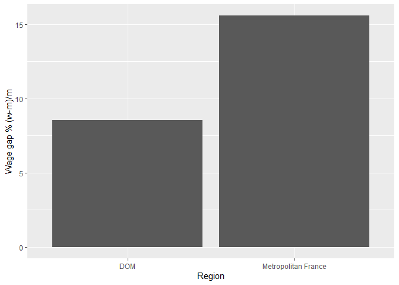

# The data:

**French regional sustainable development indicators (INSEE, accessed 11/2021):**

1. Net wage gap between men and women (2017), described by the formula: (f_net_hourly_salary - m_net_hourly_salary)/m net hourly salary.


```r
# By age group: 
pct_wage_gap_wm_age <- read.csv(paste0(base_dir, "taux ecarts salaire f-h age 2017 FR reg.csv"), sep = ",")
# By socioprofessional group:
pct_wage_gap_wm_soc <- read.csv(paste0(base_dir, "taux ecarts salaire f-h soc 2017 FR reg.csv"), sep = ",")
# Total:
pct_wage_gap_wm_tot <- read.csv(paste0(base_dir, "taux ecarts salaire f-h total 2017 FR reg.csv"), sep = ",")
```

2.1) Total rate of monetary poverty of individuals (2017)


```r
# Total:
pct.pvt.tot <- read.csv(paste0(base_dir, "taux pvt total 2017 FR reg.csv"), sep = ",")
```

2.2) Intensity of poverty (2017)


```r
intens.pvt <- read.csv(paste0(base_dir, "taux intensite pvt 2017 FR reg.csv"), sep = ",")
```

**French regional indicators on inequalities among women and men (INSEE, accessed 11/2021)**


```r
# differences in proportions of employment of women and men (w-m) in positions of authority (%)
life.cond.wm <- read.csv(paste0(base_dir, "taux ecarts cond.vie f-h comparateurs FR reg.csv"), sep=",")
# average age at first child difference b/w women and men (%)
health.wm <- read.csv(paste0(base_dir, "taux ecarts sante f-h comparateurs FR reg.csv"), sep=",")
```

## Data frames:


```r
pct_wage_gap_wm_age; pct_wage_gap_wm_soc
```

<div data-pagedtable="false">
  <script data-pagedtable-source type="application/json">
{"columns":[{"label":["libgeo"],"name":[1],"type":["chr"],"align":["left"]},{"label":["taux.ecarts.salaire.f.h"],"name":[2],"type":["dbl"],"align":["right"]},{"label":["groupe.age"],"name":[3],"type":["chr"],"align":["left"]}],"data":[{"1":"Guadeloupe","2":"2.20","3":"25 ans et moins"},{"1":"Martinique","2":"0.00","3":"25 ans et moins"},{"1":"Guyane","2":"-0.43","3":"25 ans et moins"},{"1":"La Réunion","2":"-1.37","3":"25 ans et moins"},{"1":"Mayotte","2":"NA","3":"25 ans et moins"},{"1":"Île-de-France","2":"-6.09","3":"25 ans et moins"},{"1":"Centre-Val de Loire","2":"-4.32","3":"25 ans et moins"},{"1":"Bourgogne-Franche-Comté","2":"-6.05","3":"25 ans et moins"},{"1":"Normandie","2":"-6.17","3":"25 ans et moins"},{"1":"Hauts-de-France","2":"-5.95","3":"25 ans et moins"},{"1":"Grand Est","2":"-6.26","3":"25 ans et moins"},{"1":"Pays de la Loire","2":"-5.67","3":"25 ans et moins"},{"1":"Bretagne","2":"-4.35","3":"25 ans et moins"},{"1":"Nouvelle-Aquitaine","2":"-4.62","3":"25 ans et moins"},{"1":"Occitanie","2":"-5.65","3":"25 ans et moins"},{"1":"Auvergne-Rhône-Alpes","2":"-6.40","3":"25 ans et moins"},{"1":"Provence-Alpes-Côte d'Azur","2":"-6.84","3":"25 ans et moins"},{"1":"Corse","2":"-3.95","3":"25 ans et moins"},{"1":"Guadeloupe","2":"-7.10","3":"26 à 50 ans"},{"1":"Martinique","2":"-6.56","3":"26 à 50 ans"},{"1":"Guyane","2":"-5.42","3":"26 à 50 ans"},{"1":"La Réunion","2":"-4.04","3":"26 à 50 ans"},{"1":"Mayotte","2":"NA","3":"26 à 50 ans"},{"1":"Île-de-France","2":"-10.89","3":"26 à 50 ans"},{"1":"Centre-Val de Loire","2":"-12.79","3":"26 à 50 ans"},{"1":"Bourgogne-Franche-Comté","2":"-13.44","3":"26 à 50 ans"},{"1":"Normandie","2":"-13.35","3":"26 à 50 ans"},{"1":"Hauts-de-France","2":"-11.90","3":"26 à 50 ans"},{"1":"Grand Est","2":"-14.06","3":"26 à 50 ans"},{"1":"Pays de la Loire","2":"-13.70","3":"26 à 50 ans"},{"1":"Bretagne","2":"-12.83","3":"26 à 50 ans"},{"1":"Nouvelle-Aquitaine","2":"-12.24","3":"26 à 50 ans"},{"1":"Occitanie","2":"-13.25","3":"26 à 50 ans"},{"1":"Auvergne-Rhône-Alpes","2":"-14.03","3":"26 à 50 ans"},{"1":"Provence-Alpes-Côte d'Azur","2":"-14.04","3":"26 à 50 ans"},{"1":"Corse","2":"-10.83","3":"26 à 50 ans"},{"1":"Guadeloupe","2":"-15.12","3":"plus de 50 ans"},{"1":"Martinique","2":"-14.06","3":"plus de 50 ans"},{"1":"Guyane","2":"-12.90","3":"plus de 50 ans"},{"1":"La Réunion","2":"-12.25","3":"plus de 50 ans"},{"1":"Mayotte","2":"NA","3":"plus de 50 ans"},{"1":"Île-de-France","2":"-25.01","3":"plus de 50 ans"},{"1":"Centre-Val de Loire","2":"-21.82","3":"plus de 50 ans"},{"1":"Bourgogne-Franche-Comté","2":"-21.58","3":"plus de 50 ans"},{"1":"Normandie","2":"-22.38","3":"plus de 50 ans"},{"1":"Hauts-de-France","2":"-21.28","3":"plus de 50 ans"},{"1":"Grand Est","2":"-23.82","3":"plus de 50 ans"},{"1":"Pays de la Loire","2":"-23.84","3":"plus de 50 ans"},{"1":"Bretagne","2":"-23.34","3":"plus de 50 ans"},{"1":"Nouvelle-Aquitaine","2":"-21.96","3":"plus de 50 ans"},{"1":"Occitanie","2":"-24.64","3":"plus de 50 ans"},{"1":"Auvergne-Rhône-Alpes","2":"-25.74","3":"plus de 50 ans"},{"1":"Provence-Alpes-Côte d'Azur","2":"-24.85","3":"plus de 50 ans"},{"1":"Corse","2":"-18.84","3":"plus de 50 ans"}],"options":{"columns":{"min":{},"max":[10]},"rows":{"min":[10],"max":[10]},"pages":{}}}
  </script>
</div><div data-pagedtable="false">
  <script data-pagedtable-source type="application/json">
{"columns":[{"label":["libgeo"],"name":[1],"type":["chr"],"align":["left"]},{"label":["taux.ecarts.salaire.f.h"],"name":[2],"type":["dbl"],"align":["right"]},{"label":["groupe.socioprofessionel"],"name":[3],"type":["chr"],"align":["left"]}],"data":[{"1":"Guadeloupe","2":"-18.94","3":"cadres"},{"1":"Martinique","2":"-18.58","3":"cadres"},{"1":"Guyane","2":"-19.00","3":"cadres"},{"1":"La Réunion","2":"-18.70","3":"cadres"},{"1":"Mayotte","2":"NA","3":"cadres"},{"1":"Île-de-France","2":"-20.74","3":"cadres"},{"1":"Centre-Val de Loire","2":"-18.61","3":"cadres"},{"1":"Bourgogne-Franche-Comté","2":"-18.79","3":"cadres"},{"1":"Normandie","2":"-18.72","3":"cadres"},{"1":"Hauts-de-France","2":"-18.18","3":"cadres"},{"1":"Grand Est","2":"-18.88","3":"cadres"},{"1":"Pays de la Loire","2":"-18.81","3":"cadres"},{"1":"Bretagne","2":"-19.10","3":"cadres"},{"1":"Nouvelle-Aquitaine","2":"-19.30","3":"cadres"},{"1":"Occitanie","2":"-17.50","3":"cadres"},{"1":"Auvergne-Rhône-Alpes","2":"-18.85","3":"cadres"},{"1":"Provence-Alpes-Côte d'Azur","2":"-19.18","3":"cadres"},{"1":"Corse","2":"-17.20","3":"cadres"},{"1":"Guadeloupe","2":"-8.05","3":"professions intermédiaires"},{"1":"Martinique","2":"-7.65","3":"professions intermédiaires"},{"1":"Guyane","2":"-14.46","3":"professions intermédiaires"},{"1":"La Réunion","2":"-6.93","3":"professions intermédiaires"},{"1":"Mayotte","2":"NA","3":"professions intermédiaires"},{"1":"Île-de-France","2":"-7.94","3":"professions intermédiaires"},{"1":"Centre-Val de Loire","2":"-10.98","3":"professions intermédiaires"},{"1":"Bourgogne-Franche-Comté","2":"-12.51","3":"professions intermédiaires"},{"1":"Normandie","2":"-13.84","3":"professions intermédiaires"},{"1":"Hauts-de-France","2":"-12.48","3":"professions intermédiaires"},{"1":"Grand Est","2":"-13.59","3":"professions intermédiaires"},{"1":"Pays de la Loire","2":"-11.31","3":"professions intermédiaires"},{"1":"Bretagne","2":"-10.58","3":"professions intermédiaires"},{"1":"Nouvelle-Aquitaine","2":"-11.19","3":"professions intermédiaires"},{"1":"Occitanie","2":"-12.08","3":"professions intermédiaires"},{"1":"Auvergne-Rhône-Alpes","2":"-12.52","3":"professions intermédiaires"},{"1":"Provence-Alpes-Côte d'Azur","2":"-14.14","3":"professions intermédiaires"},{"1":"Corse","2":"-16.04","3":"professions intermédiaires"},{"1":"Guadeloupe","2":"-5.22","3":"employés"},{"1":"Martinique","2":"-4.45","3":"employés"},{"1":"Guyane","2":"-0.97","3":"employés"},{"1":"La Réunion","2":"-2.16","3":"employés"},{"1":"Mayotte","2":"NA","3":"employés"},{"1":"Île-de-France","2":"-0.36","3":"employés"},{"1":"Centre-Val de Loire","2":"-5.37","3":"employés"},{"1":"Bourgogne-Franche-Comté","2":"-6.64","3":"employés"},{"1":"Normandie","2":"-6.63","3":"employés"},{"1":"Hauts-de-France","2":"-6.28","3":"employés"},{"1":"Grand Est","2":"-6.57","3":"employés"},{"1":"Pays de la Loire","2":"-6.75","3":"employés"},{"1":"Bretagne","2":"-5.87","3":"employés"},{"1":"Nouvelle-Aquitaine","2":"-5.67","3":"employés"},{"1":"Occitanie","2":"-5.50","3":"employés"},{"1":"Auvergne-Rhône-Alpes","2":"-6.05","3":"employés"},{"1":"Provence-Alpes-Côte d'Azur","2":"-5.11","3":"employés"},{"1":"Corse","2":"-7.61","3":"employés"},{"1":"Guadeloupe","2":"-13.28","3":"ouvriers"},{"1":"Martinique","2":"-15.23","3":"ouvriers"},{"1":"Guyane","2":"-16.21","3":"ouvriers"},{"1":"La Réunion","2":"-14.15","3":"ouvriers"},{"1":"Mayotte","2":"NA","3":"ouvriers"},{"1":"Île-de-France","2":"-12.02","3":"ouvriers"},{"1":"Centre-Val de Loire","2":"-8.51","3":"ouvriers"},{"1":"Bourgogne-Franche-Comté","2":"-10.86","3":"ouvriers"},{"1":"Normandie","2":"-11.53","3":"ouvriers"},{"1":"Hauts-de-France","2":"-12.44","3":"ouvriers"},{"1":"Grand Est","2":"-13.16","3":"ouvriers"},{"1":"Pays de la Loire","2":"-10.25","3":"ouvriers"},{"1":"Bretagne","2":"-8.91","3":"ouvriers"},{"1":"Nouvelle-Aquitaine","2":"-10.83","3":"ouvriers"},{"1":"Occitanie","2":"-10.04","3":"ouvriers"},{"1":"Auvergne-Rhône-Alpes","2":"-11.65","3":"ouvriers"},{"1":"Provence-Alpes-Côte d'Azur","2":"-14.41","3":"ouvriers"},{"1":"Corse","2":"-14.30","3":"ouvriers"}],"options":{"columns":{"min":{},"max":[10]},"rows":{"min":[10],"max":[10]},"pages":{}}}
  </script>
</div>

```r
pct_wage_gap_wm_tot; pct.pvt.tot; intens.pvt; life.cond.wm; health.wm
```

<div data-pagedtable="false">
  <script data-pagedtable-source type="application/json">
{"columns":[{"label":["libgeo"],"name":[1],"type":["chr"],"align":["left"]},{"label":["taux.ecarts.salaire.f.h"],"name":[2],"type":["dbl"],"align":["right"]}],"data":[{"1":"Guadeloupe","2":"-9.52"},{"1":"Martinique","2":"-9.08"},{"1":"Guyane","2":"-8.81"},{"1":"La Réunion","2":"-6.81"},{"1":"Mayotte","2":"NA"},{"1":"Île-de-France","2":"-15.85"},{"1":"Centre-Val de Loire","2":"-14.97"},{"1":"Bourgogne-Franche-Comté","2":"-15.39"},{"1":"Normandie","2":"-15.68"},{"1":"Hauts-de-France","2":"-14.58"},{"1":"Grand Est","2":"-16.74"},{"1":"Pays de la Loire","2":"-15.96"},{"1":"Bretagne","2":"-15.17"},{"1":"Nouvelle-Aquitaine","2":"-14.65"},{"1":"Occitanie","2":"-16.28"},{"1":"Auvergne-Rhône-Alpes","2":"-17.09"},{"1":"Provence-Alpes-Côte d'Azur","2":"-17.23"},{"1":"Corse","2":"-13.04"}],"options":{"columns":{"min":{},"max":[10]},"rows":{"min":[10],"max":[10]},"pages":{}}}
  </script>
</div><div data-pagedtable="false">
  <script data-pagedtable-source type="application/json">
{"columns":[{"label":["libgeo"],"name":[1],"type":["chr"],"align":["left"]},{"label":["total"],"name":[2],"type":["dbl"],"align":["right"]}],"data":[{"1":"Guadeloupe","2":"34.5"},{"1":"Martinique","2":"28.6"},{"1":"Guyane","2":"52.9"},{"1":"La Réunion","2":"38.3"},{"1":"Mayotte","2":"77.3"},{"1":"Île-de-France","2":"15.3"},{"1":"Centre-Val de Loire","2":"13.2"},{"1":"Bourgogne-Franche-Comté","2":"12.8"},{"1":"Normandie","2":"13.4"},{"1":"Hauts-de-France","2":"17.9"},{"1":"Grand Est","2":"14.5"},{"1":"Pays de la Loire","2":"10.8"},{"1":"Bretagne","2":"10.9"},{"1":"Nouvelle-Aquitaine","2":"13.5"},{"1":"Occitanie","2":"16.8"},{"1":"Auvergne-Rhône-Alpes","2":"12.5"},{"1":"Provence-Alpes-Côte d'Azur","2":"17.0"},{"1":"Corse","2":"18.7"}],"options":{"columns":{"min":{},"max":[10]},"rows":{"min":[10],"max":[10]},"pages":{}}}
  </script>
</div><div data-pagedtable="false">
  <script data-pagedtable-source type="application/json">
{"columns":[{"label":["libgeo"],"name":[1],"type":["chr"],"align":["left"]},{"label":["total.2017"],"name":[2],"type":["dbl"],"align":["right"]}],"data":[{"1":"Guadeloupe","2":"24.8"},{"1":"Martinique","2":"23.5"},{"1":"Guyane","2":"40.4"},{"1":"La Réunion","2":"23.3"},{"1":"Mayotte","2":"87.3"},{"1":"Île-de-France","2":"22.4"},{"1":"Centre-Val de Loire","2":"19.5"},{"1":"Bourgogne-Franche-Comté","2":"18.4"},{"1":"Normandie","2":"18.7"},{"1":"Hauts-de-France","2":"18.8"},{"1":"Grand Est","2":"19.6"},{"1":"Pays de la Loire","2":"17.9"},{"1":"Bretagne","2":"18.2"},{"1":"Nouvelle-Aquitaine","2":"19.3"},{"1":"Occitanie","2":"20.4"},{"1":"Auvergne-Rhône-Alpes","2":"19.5"},{"1":"Provence-Alpes-Côte d'Azur","2":"21.4"},{"1":"Corse","2":"21.5"}],"options":{"columns":{"min":{},"max":[10]},"rows":{"min":[10],"max":[10]},"pages":{}}}
  </script>
</div><div data-pagedtable="false">
  <script data-pagedtable-source type="application/json">
{"columns":[{"label":["Région"],"name":[1],"type":["chr"],"align":["left"]},{"label":["conseils.municipaux.2021"],"name":[2],"type":["dbl"],"align":["right"]}],"data":[{"1":"Guadeloupe","2":"0.2"},{"1":"Martinique","2":"-2.0"},{"1":"Guyane","2":"-3.4"},{"1":"Réunion","2":"-0.4"},{"1":"Mayotte","2":"NA"},{"1":"Ile-de-France","2":"-3.8"},{"1":"Centre-Val de Loire","2":"-10.4"},{"1":"Bourgogne-Franche-Comté","2":"-19.0"},{"1":"Normandie","2":"-12.2"},{"1":"Hauts-de-France","2":"-15.0"},{"1":"Grand Est","2":"-19.4"},{"1":"Pays de la Loire","2":"-4.4"},{"1":"Bretagne","2":"-3.4"},{"1":"Nouvelle-Aquitaine","2":"-10.2"},{"1":"Occitanie","2":"-12.6"},{"1":"Auvergne-Rhône-Alpes","2":"-9.2"},{"1":"Provence-Alpes-Côte d'Azur","2":"-7.4"},{"1":"Corse","2":"-20.2"}],"options":{"columns":{"min":{},"max":[10]},"rows":{"min":[10],"max":[10]},"pages":{}}}
  </script>
</div><div data-pagedtable="false">
  <script data-pagedtable-source type="application/json">
{"columns":[{"label":["Région"],"name":[1],"type":["chr"],"align":["left"]},{"label":["age.moy.parentalité.années.2019"],"name":[2],"type":["dbl"],"align":["right"]}],"data":[{"1":"Guadeloupe","2":"-3.7"},{"1":"Martinique","2":"-3.6"},{"1":"Guyane","2":"-4.5"},{"1":"Réunion","2":"-3.3"},{"1":"Mayotte","2":"-6.6"},{"1":"Ile-de-France","2":"-3.5"},{"1":"Centre-Val de Loire","2":"-2.8"},{"1":"Bourgogne-Franche-Comté","2":"-2.8"},{"1":"Normandie","2":"-2.7"},{"1":"Hauts-de-France","2":"-2.8"},{"1":"Grand Est","2":"-2.9"},{"1":"Pays de la Loire","2":"-2.5"},{"1":"Bretagne","2":"-2.4"},{"1":"Nouvelle-Aquitaine","2":"-2.7"},{"1":"Occitanie","2":"-2.9"},{"1":"Auvergne-Rhône-Alpes","2":"-2.8"},{"1":"Provence-Alpes-Côte d'Azur","2":"-3.2"},{"1":"Corse","2":"-3.6"}],"options":{"columns":{"min":{},"max":[10]},"rows":{"min":[10],"max":[10]},"pages":{}}}
  </script>
</div>

# Analysis:

**Research question 1: [Is there a difference in the recorded wage gap between women and men in different age groups in 2017 between metropolitan France and the DOM?]**

- Two way ANOVA using IVs = [regions, age group or socioprofessional group], DV = [wage gap %]
- Post Hoc test on the results
- Result reporting and analysis.

### Data preparation:

Base data frame: `pct_wage_gap_wm_age`


```r
# translate the column titles to English
pct_wage_gap_wm_age <- pct_wage_gap_wm_age %>% 
  rename(Region = libgeo,
         Age_group = "groupe.age",
         Wage_gap_pct = "taux.ecarts.salaire.f.h")

# check for gaps in data:
pct_wage_gap_wm_age %>%
  filter(is.na(Wage_gap_pct))
```

<div data-pagedtable="false">
  <script data-pagedtable-source type="application/json">
{"columns":[{"label":["Region"],"name":[1],"type":["chr"],"align":["left"]},{"label":["Wage_gap_pct"],"name":[2],"type":["dbl"],"align":["right"]},{"label":["Age_group"],"name":[3],"type":["chr"],"align":["left"]}],"data":[{"1":"Mayotte","2":"NA","3":"25 ans et moins"},{"1":"Mayotte","2":"NA","3":"26 à 50 ans"},{"1":"Mayotte","2":"NA","3":"plus de 50 ans"}],"options":{"columns":{"min":{},"max":[10]},"rows":{"min":[10],"max":[10]},"pages":{}}}
  </script>
</div>

```r
pct_wage_gap_wm_age <- pct_wage_gap_wm_age %>%
  # Filter Mayotte out of the data set:
  filter(Region != "Mayotte") %>% 
  # separate the data into two groups: metropolitan and DOM
  mutate(Geographic_region_group = ifelse(Region == "Guadeloupe" | Region == "Martinique" | Region == "Guyane" | Region == "La Réunion", "DOM", "Metropolitan France")) %>% 
  # translate the Wage_gap_pct values to English
  mutate(Age_group = recode(Age_group, "25 ans et moins"="25 and lower","26 à 50 ans"="26 to 50","plus de 50 ans"="more than 50"))
```

### Visualisation and testing:


```r
# visualise data frame
pct_wage_gap_wm_age
```

<div data-pagedtable="false">
  <script data-pagedtable-source type="application/json">
{"columns":[{"label":["Region"],"name":[1],"type":["chr"],"align":["left"]},{"label":["Wage_gap_pct"],"name":[2],"type":["dbl"],"align":["right"]},{"label":["Age_group"],"name":[3],"type":["chr"],"align":["left"]},{"label":["Geographic_region_group"],"name":[4],"type":["chr"],"align":["left"]}],"data":[{"1":"Guadeloupe","2":"2.20","3":"25 and lower","4":"DOM"},{"1":"Martinique","2":"0.00","3":"25 and lower","4":"DOM"},{"1":"Guyane","2":"-0.43","3":"25 and lower","4":"DOM"},{"1":"La Réunion","2":"-1.37","3":"25 and lower","4":"DOM"},{"1":"Île-de-France","2":"-6.09","3":"25 and lower","4":"Metropolitan France"},{"1":"Centre-Val de Loire","2":"-4.32","3":"25 and lower","4":"Metropolitan France"},{"1":"Bourgogne-Franche-Comté","2":"-6.05","3":"25 and lower","4":"Metropolitan France"},{"1":"Normandie","2":"-6.17","3":"25 and lower","4":"Metropolitan France"},{"1":"Hauts-de-France","2":"-5.95","3":"25 and lower","4":"Metropolitan France"},{"1":"Grand Est","2":"-6.26","3":"25 and lower","4":"Metropolitan France"},{"1":"Pays de la Loire","2":"-5.67","3":"25 and lower","4":"Metropolitan France"},{"1":"Bretagne","2":"-4.35","3":"25 and lower","4":"Metropolitan France"},{"1":"Nouvelle-Aquitaine","2":"-4.62","3":"25 and lower","4":"Metropolitan France"},{"1":"Occitanie","2":"-5.65","3":"25 and lower","4":"Metropolitan France"},{"1":"Auvergne-Rhône-Alpes","2":"-6.40","3":"25 and lower","4":"Metropolitan France"},{"1":"Provence-Alpes-Côte d'Azur","2":"-6.84","3":"25 and lower","4":"Metropolitan France"},{"1":"Corse","2":"-3.95","3":"25 and lower","4":"Metropolitan France"},{"1":"Guadeloupe","2":"-7.10","3":"26 to 50","4":"DOM"},{"1":"Martinique","2":"-6.56","3":"26 to 50","4":"DOM"},{"1":"Guyane","2":"-5.42","3":"26 to 50","4":"DOM"},{"1":"La Réunion","2":"-4.04","3":"26 to 50","4":"DOM"},{"1":"Île-de-France","2":"-10.89","3":"26 to 50","4":"Metropolitan France"},{"1":"Centre-Val de Loire","2":"-12.79","3":"26 to 50","4":"Metropolitan France"},{"1":"Bourgogne-Franche-Comté","2":"-13.44","3":"26 to 50","4":"Metropolitan France"},{"1":"Normandie","2":"-13.35","3":"26 to 50","4":"Metropolitan France"},{"1":"Hauts-de-France","2":"-11.90","3":"26 to 50","4":"Metropolitan France"},{"1":"Grand Est","2":"-14.06","3":"26 to 50","4":"Metropolitan France"},{"1":"Pays de la Loire","2":"-13.70","3":"26 to 50","4":"Metropolitan France"},{"1":"Bretagne","2":"-12.83","3":"26 to 50","4":"Metropolitan France"},{"1":"Nouvelle-Aquitaine","2":"-12.24","3":"26 to 50","4":"Metropolitan France"},{"1":"Occitanie","2":"-13.25","3":"26 to 50","4":"Metropolitan France"},{"1":"Auvergne-Rhône-Alpes","2":"-14.03","3":"26 to 50","4":"Metropolitan France"},{"1":"Provence-Alpes-Côte d'Azur","2":"-14.04","3":"26 to 50","4":"Metropolitan France"},{"1":"Corse","2":"-10.83","3":"26 to 50","4":"Metropolitan France"},{"1":"Guadeloupe","2":"-15.12","3":"more than 50","4":"DOM"},{"1":"Martinique","2":"-14.06","3":"more than 50","4":"DOM"},{"1":"Guyane","2":"-12.90","3":"more than 50","4":"DOM"},{"1":"La Réunion","2":"-12.25","3":"more than 50","4":"DOM"},{"1":"Île-de-France","2":"-25.01","3":"more than 50","4":"Metropolitan France"},{"1":"Centre-Val de Loire","2":"-21.82","3":"more than 50","4":"Metropolitan France"},{"1":"Bourgogne-Franche-Comté","2":"-21.58","3":"more than 50","4":"Metropolitan France"},{"1":"Normandie","2":"-22.38","3":"more than 50","4":"Metropolitan France"},{"1":"Hauts-de-France","2":"-21.28","3":"more than 50","4":"Metropolitan France"},{"1":"Grand Est","2":"-23.82","3":"more than 50","4":"Metropolitan France"},{"1":"Pays de la Loire","2":"-23.84","3":"more than 50","4":"Metropolitan France"},{"1":"Bretagne","2":"-23.34","3":"more than 50","4":"Metropolitan France"},{"1":"Nouvelle-Aquitaine","2":"-21.96","3":"more than 50","4":"Metropolitan France"},{"1":"Occitanie","2":"-24.64","3":"more than 50","4":"Metropolitan France"},{"1":"Auvergne-Rhône-Alpes","2":"-25.74","3":"more than 50","4":"Metropolitan France"},{"1":"Provence-Alpes-Côte d'Azur","2":"-24.85","3":"more than 50","4":"Metropolitan France"},{"1":"Corse","2":"-18.84","3":"more than 50","4":"Metropolitan France"}],"options":{"columns":{"min":{},"max":[10]},"rows":{"min":[10],"max":[10]},"pages":{}}}
  </script>
</div>

```r
# visualise distribution of wage gap percentages between women and men in France
pct_wage_gap_wm_age %>% 
  ggplot(aes(x=Wage_gap_pct)) +
  geom_histogram(binwidth = 1) + 
  labs(title="Distribution of net wage gaps \nbetween women and men in France by age", x="Wage gap w-m (%)", y="Frequency", caption="Source: INSEE")
```

<!-- -->

```r
# visualise box plot of data frame: 
pct_wage_gap_wm_age %>% 
  ggplot(aes(x=Age_group, y=Wage_gap_pct, colour=Geographic_region_group)) +
  geom_point(position = position_jitterdodge()) +
  geom_boxplot(fill=NA) + 
  labs(title="Wage gaps between women and men \nby age groups and geographic region", x="Age group", y="Wage gap w-m (%)", colour="Geographic region", caption = "Source: INSEE")
```

<!-- -->

```r
# Null hypotheses:
# H0_1: there is no main effect of factor A
# H0_2: there is no main effect of factor B
# H0_3: there is no interaction between factors A and B

# visualise interaction plot of variables

pct_wage_gap_wm_age %>% 
  group_by(Age_group, Geographic_region_group) %>% 
  summarise(means = mean(Wage_gap_pct)) %>% 
  ggplot(aes(Geographic_region_group, means)) +
  geom_line(size = 1.2, aes(group = Age_group, color = Age_group)) +
  geom_point(size = 2.6, aes(color = Age_group), shape = 15) +
  labs(title="Interaction plot of Age groups \nand geographic region groups", x="Geographic region", y="Mean wage gap w-m (%)" , colour="Age", caption="Source: INSEE")
```

```
## `summarise()` has grouped output by 'Age_group'. You can override using the `.groups` argument.
```

<!-- -->

```r
# conduct ANOVA
aov1 <- aov(Wage_gap_pct~Region+Age_group+Region*Age_group, data=pct_wage_gap_wm_age)
summary(aov1)
```

```
##                  Df Sum Sq Mean Sq
## Region           16  549.0    34.3
## Age_group         2 2350.2  1175.1
## Region:Age_group 32   61.5     1.9
```

```r
# report results (see below)
```

### Results:
>A two-way ANOVA (table below) revealed a significant effect of geographic region (P < 0.01) and age group (P < 0.01) on wage gap % between women and men, but with a significant interaction between geographic region and age group (P < 0.01). Observations in age group age>50 in Metropolitan France yielded higher wage gap results than expected when compared to the values found in other age group observations.

**Research question 2: [Is there a difference in the recorded wage gap between women and men in different socioprofessional groups in 2017 between metropolitan France and the DOM?]**

- Two way ANOVA using IVs = [regions, age group/socioprofessional group], DV = [wage gap %]
- Post Hoc test on the results
- Result reporting and analysis.

Socioprofessional group nomenclature (INSEE, 2013): https://www.insee.fr/fr/metadonnees/pcs2003/categorieSocioprofessionnelleAgregee/1?champRecherche=true

### Data preparation:

Base data frame: `taux.ecarts.salaires.fh.soc`


```r
# translate the column titles to English
pct_wage_gap_wm_soc <- pct_wage_gap_wm_soc %>% 
  rename(Region = libgeo,
         Socioprofessional_group = "groupe.socioprofessionel",
         Wage_gap_pct = "taux.ecarts.salaire.f.h")

# check for gaps in data:
pct_wage_gap_wm_soc %>%
  filter(is.na(Wage_gap_pct))
```

<div data-pagedtable="false">
  <script data-pagedtable-source type="application/json">
{"columns":[{"label":["Region"],"name":[1],"type":["chr"],"align":["left"]},{"label":["Wage_gap_pct"],"name":[2],"type":["dbl"],"align":["right"]},{"label":["Socioprofessional_group"],"name":[3],"type":["chr"],"align":["left"]}],"data":[{"1":"Mayotte","2":"NA","3":"cadres"},{"1":"Mayotte","2":"NA","3":"professions intermédiaires"},{"1":"Mayotte","2":"NA","3":"employés"},{"1":"Mayotte","2":"NA","3":"ouvriers"}],"options":{"columns":{"min":{},"max":[10]},"rows":{"min":[10],"max":[10]},"pages":{}}}
  </script>
</div>

```r
pct_wage_gap_wm_soc <- pct_wage_gap_wm_soc %>%
  # Filter Mayotte out of the data set:
  filter(Region != "Mayotte") %>% 
  # separate the data into two groups: metropolitan and DOM
  mutate(Geographic_region_group = ifelse(Region == "Guadeloupe" | Region == "Martinique" | Region == "Guyane" | Region == "La Réunion", "DOM", "Metropolitan France")) %>% 
  # translate the Wage_gap_pct values to English
  mutate(Socioprofessional_group = recode(Socioprofessional_group, "cadres"="executives","professions intermédiaires"="intermediary positions","employés"="employees", "ouvriers"="workers"))
```

### Visualisation and testing:


```r
# visualise data frame
pct_wage_gap_wm_soc
```

<div data-pagedtable="false">
  <script data-pagedtable-source type="application/json">
{"columns":[{"label":["Region"],"name":[1],"type":["chr"],"align":["left"]},{"label":["Wage_gap_pct"],"name":[2],"type":["dbl"],"align":["right"]},{"label":["Socioprofessional_group"],"name":[3],"type":["chr"],"align":["left"]},{"label":["Geographic_region_group"],"name":[4],"type":["chr"],"align":["left"]}],"data":[{"1":"Guadeloupe","2":"-18.94","3":"executives","4":"DOM"},{"1":"Martinique","2":"-18.58","3":"executives","4":"DOM"},{"1":"Guyane","2":"-19.00","3":"executives","4":"DOM"},{"1":"La Réunion","2":"-18.70","3":"executives","4":"DOM"},{"1":"Île-de-France","2":"-20.74","3":"executives","4":"Metropolitan France"},{"1":"Centre-Val de Loire","2":"-18.61","3":"executives","4":"Metropolitan France"},{"1":"Bourgogne-Franche-Comté","2":"-18.79","3":"executives","4":"Metropolitan France"},{"1":"Normandie","2":"-18.72","3":"executives","4":"Metropolitan France"},{"1":"Hauts-de-France","2":"-18.18","3":"executives","4":"Metropolitan France"},{"1":"Grand Est","2":"-18.88","3":"executives","4":"Metropolitan France"},{"1":"Pays de la Loire","2":"-18.81","3":"executives","4":"Metropolitan France"},{"1":"Bretagne","2":"-19.10","3":"executives","4":"Metropolitan France"},{"1":"Nouvelle-Aquitaine","2":"-19.30","3":"executives","4":"Metropolitan France"},{"1":"Occitanie","2":"-17.50","3":"executives","4":"Metropolitan France"},{"1":"Auvergne-Rhône-Alpes","2":"-18.85","3":"executives","4":"Metropolitan France"},{"1":"Provence-Alpes-Côte d'Azur","2":"-19.18","3":"executives","4":"Metropolitan France"},{"1":"Corse","2":"-17.20","3":"executives","4":"Metropolitan France"},{"1":"Guadeloupe","2":"-8.05","3":"intermediary positions","4":"DOM"},{"1":"Martinique","2":"-7.65","3":"intermediary positions","4":"DOM"},{"1":"Guyane","2":"-14.46","3":"intermediary positions","4":"DOM"},{"1":"La Réunion","2":"-6.93","3":"intermediary positions","4":"DOM"},{"1":"Île-de-France","2":"-7.94","3":"intermediary positions","4":"Metropolitan France"},{"1":"Centre-Val de Loire","2":"-10.98","3":"intermediary positions","4":"Metropolitan France"},{"1":"Bourgogne-Franche-Comté","2":"-12.51","3":"intermediary positions","4":"Metropolitan France"},{"1":"Normandie","2":"-13.84","3":"intermediary positions","4":"Metropolitan France"},{"1":"Hauts-de-France","2":"-12.48","3":"intermediary positions","4":"Metropolitan France"},{"1":"Grand Est","2":"-13.59","3":"intermediary positions","4":"Metropolitan France"},{"1":"Pays de la Loire","2":"-11.31","3":"intermediary positions","4":"Metropolitan France"},{"1":"Bretagne","2":"-10.58","3":"intermediary positions","4":"Metropolitan France"},{"1":"Nouvelle-Aquitaine","2":"-11.19","3":"intermediary positions","4":"Metropolitan France"},{"1":"Occitanie","2":"-12.08","3":"intermediary positions","4":"Metropolitan France"},{"1":"Auvergne-Rhône-Alpes","2":"-12.52","3":"intermediary positions","4":"Metropolitan France"},{"1":"Provence-Alpes-Côte d'Azur","2":"-14.14","3":"intermediary positions","4":"Metropolitan France"},{"1":"Corse","2":"-16.04","3":"intermediary positions","4":"Metropolitan France"},{"1":"Guadeloupe","2":"-5.22","3":"employees","4":"DOM"},{"1":"Martinique","2":"-4.45","3":"employees","4":"DOM"},{"1":"Guyane","2":"-0.97","3":"employees","4":"DOM"},{"1":"La Réunion","2":"-2.16","3":"employees","4":"DOM"},{"1":"Île-de-France","2":"-0.36","3":"employees","4":"Metropolitan France"},{"1":"Centre-Val de Loire","2":"-5.37","3":"employees","4":"Metropolitan France"},{"1":"Bourgogne-Franche-Comté","2":"-6.64","3":"employees","4":"Metropolitan France"},{"1":"Normandie","2":"-6.63","3":"employees","4":"Metropolitan France"},{"1":"Hauts-de-France","2":"-6.28","3":"employees","4":"Metropolitan France"},{"1":"Grand Est","2":"-6.57","3":"employees","4":"Metropolitan France"},{"1":"Pays de la Loire","2":"-6.75","3":"employees","4":"Metropolitan France"},{"1":"Bretagne","2":"-5.87","3":"employees","4":"Metropolitan France"},{"1":"Nouvelle-Aquitaine","2":"-5.67","3":"employees","4":"Metropolitan France"},{"1":"Occitanie","2":"-5.50","3":"employees","4":"Metropolitan France"},{"1":"Auvergne-Rhône-Alpes","2":"-6.05","3":"employees","4":"Metropolitan France"},{"1":"Provence-Alpes-Côte d'Azur","2":"-5.11","3":"employees","4":"Metropolitan France"},{"1":"Corse","2":"-7.61","3":"employees","4":"Metropolitan France"},{"1":"Guadeloupe","2":"-13.28","3":"workers","4":"DOM"},{"1":"Martinique","2":"-15.23","3":"workers","4":"DOM"},{"1":"Guyane","2":"-16.21","3":"workers","4":"DOM"},{"1":"La Réunion","2":"-14.15","3":"workers","4":"DOM"},{"1":"Île-de-France","2":"-12.02","3":"workers","4":"Metropolitan France"},{"1":"Centre-Val de Loire","2":"-8.51","3":"workers","4":"Metropolitan France"},{"1":"Bourgogne-Franche-Comté","2":"-10.86","3":"workers","4":"Metropolitan France"},{"1":"Normandie","2":"-11.53","3":"workers","4":"Metropolitan France"},{"1":"Hauts-de-France","2":"-12.44","3":"workers","4":"Metropolitan France"},{"1":"Grand Est","2":"-13.16","3":"workers","4":"Metropolitan France"},{"1":"Pays de la Loire","2":"-10.25","3":"workers","4":"Metropolitan France"},{"1":"Bretagne","2":"-8.91","3":"workers","4":"Metropolitan France"},{"1":"Nouvelle-Aquitaine","2":"-10.83","3":"workers","4":"Metropolitan France"},{"1":"Occitanie","2":"-10.04","3":"workers","4":"Metropolitan France"},{"1":"Auvergne-Rhône-Alpes","2":"-11.65","3":"workers","4":"Metropolitan France"},{"1":"Provence-Alpes-Côte d'Azur","2":"-14.41","3":"workers","4":"Metropolitan France"},{"1":"Corse","2":"-14.30","3":"workers","4":"Metropolitan France"}],"options":{"columns":{"min":{},"max":[10]},"rows":{"min":[10],"max":[10]},"pages":{}}}
  </script>
</div>

```r
# visualise distribution of wage gap percentages between women and men in France
pct_wage_gap_wm_soc %>% 
  ggplot(aes(x=Wage_gap_pct)) +
  geom_histogram(binwidth = 1) + 
  labs(title="Distribution of net wage gap \nbetween women and men in France by socioprofessional designation", x="Wage gap w-m (%)", y="Frequency", caption="Source: INSEE")
```

<!-- -->

```r
# sort data frame to display ordered x-axis on boxplot
pct_wage_gap_wm_soc$Socioprofessional_group <- factor(pct_wage_gap_wm_soc$Socioprofessional_group, levels=c("executives" , "intermediary positions", "employees", "workers"))
pct_wage_gap_wm_soc$Geographic_region_group <- factor(pct_wage_gap_wm_soc$Geographic_region_group, levels=c("Metropolitan France", "DOM"))

# visualise box plot of data frame: 
pct_wage_gap_wm_soc %>% 
  ggplot(aes(x=Socioprofessional_group, y=Wage_gap_pct, colour=Geographic_region_group)) +
  geom_point(position = position_jitterdodge()) +
  geom_boxplot(fill=NA) + 
  labs(title="Wage gap between women and men \nby socioprofessional designation and geographic region", x="Socioprofessional designation", y="Wage gap w-m (%)", colour="Geographic region", caption = "Source: INSEE")
```

<!-- -->

```r
# add boxplot for executives because it is too small to visualise in the shared boxplot
pct_wage_gap_wm_soc %>% 
  filter(Socioprofessional_group == "executives") %>% 
  ggplot(aes(x=Socioprofessional_group, y=Wage_gap_pct, colour=Geographic_region_group)) +
  geom_point(position = position_jitterdodge()) +
  geom_boxplot(fill=NA) +
  labs(title="Wage gap between women and men who are \nexecutives by geographic region", x="Socioprofessional designation", y="Wage gap w-m (%)", colour="Geographic region", caption="Source: INSEE")
```

<!-- -->

```r
# Null hypotheses:
# H0_1: there is no main effect of factor A
# H0_2: there is no main effect of factor B
# H0_3: there is no interaction between factors A and B

# visualise interaction plot of variables

pct_wage_gap_wm_soc %>% 
  group_by(Socioprofessional_group, Geographic_region_group) %>% 
  summarise(means = mean(Wage_gap_pct)) %>% 
  ggplot(aes(Geographic_region_group, means)) +
  geom_line(size = 1.2, aes(group = Socioprofessional_group, color = Socioprofessional_group)) +
  geom_point(size = 2.6, aes(color = Socioprofessional_group), shape = 15) +
  labs(title="Interaction plot of Socioprofessional groups \nand geographic region groups", x="Geographic region", y="Mean wage gap w-m (%)" , colour="Age", caption="Source: INSEE")
```

```
## `summarise()` has grouped output by 'Socioprofessional_group'. You can override using the `.groups` argument.
```

<!-- -->

```r
# conduct ANOVA
aov2 <- aov(Wage_gap_pct~Geographic_region_group+Socioprofessional_group+Geographic_region_group*Socioprofessional_group, data=pct_wage_gap_wm_soc)
summary(aov2)
```

```
##                                                 Df Sum Sq Mean Sq F value
## Geographic_region_group                          1    3.7     3.7   1.176
## Socioprofessional_group                          3 1585.2   528.4 169.760
## Geographic_region_group:Socioprofessional_group  3   75.4    25.1   8.079
## Residuals                                       60  186.8     3.1        
##                                                   Pr(>F)    
## Geographic_region_group                         0.282469    
## Socioprofessional_group                          < 2e-16 ***
## Geographic_region_group:Socioprofessional_group 0.000132 ***
## Residuals                                                   
## ---
## Signif. codes:  0 '***' 0.001 '**' 0.01 '*' 0.05 '.' 0.1 ' ' 1
```

```r
# report results (see below)
```

### Results:
>A two-way ANOVA (table below) revealed a significant effect of socioprofessional group (P < 0.01) but not geographic region (P = 0.28) on wage gap % between women and men, but with a significant interaction between geographic region and socioprofessional group (P < 0.01). In Metropolitan France, observations of workers showed yielded lower wage gap values when compared to DOM observations, for employees and intermediary positions the effect was reversed (interaction plot on slide 8)."

## Test 3:
- NMDS using [regions] as different observations and rates (%) of total [monetary poverty, intensity of poverty, net wage gap (absolute values), total employemt rate gap in official municipality poistions (%), and number of years gap between average ages at fist chile for women and men (y)] as vectors; (bubles would be metropolitan France and the DOM).

good NMDS resource: https://www.youtube.com/watch?v=Kl49qI3XJKY


```r
# data sets to use (variables cols ~ region rows):
# - total wage gap % ((w-m*)-1) <- important
# - total monetary poverty %
# - total intensity of poverty %
# - total employment rate gap in official municipal positions % ((w-m)*-1)
# - n year gap between average ages at first child for women and men (y) ((w-m)*-1)  

# multiplications by -1 made so that higher values are equated to larger imbalances disfavouring women.

# define starting data frame for nmds: columns of variables and rows of samples
nmdsData <- data.frame(geographic.region = pct_wage_gap_wm_tot$libgeo,
                       wage.gap = pct_wage_gap_wm_tot$taux.ecarts.salaire.f.h*-1,
                       monetary.poverty = pct.pvt.tot$total,
                       poverty.intensity = intens.pvt$total.2017,
                       ofc.employment.gap = life.cond.wm$conseils.municipaux.2021*-1,
                       age.first.child.y.gap = health.wm$age.moy.parentalité.années.2019*-1)

nmdsData <- subset(nmdsData, geographic.region != "Mayotte")
groupsData <- data.frame(geographic.region = c(1, 1, 1, 1, 2, 2, 2, 2, 2, 2, 2, 2, 2, 2, 2, 2, 2))

# libraries
library(vegan)
```

```
## Loading required package: permute
```

```
## This is vegan 2.5-7
```

```r
library(robustHD)
```

```
## Loading required package: perry
```

```
## Loading required package: parallel
```

```
## Loading required package: robustbase
```

```
## 
## Attaching package: 'robustbase'
```

```
## The following object is masked from 'package:survival':
## 
##     heart
```

```r
# convert data frame to matrix (+ maybe assign region names to rows)
nmdsMatrix <- as.matrix(standardize(nmdsData[, 2:6]))
rownames(nmdsMatrix) <- nmdsData$geographic.region

# shift minimums so that all values are positive (see http://strata.uga.edu/8370/lecturenotes/multidimensionalScaling.html)
minShift <- function(x) {x + abs(min(x))}
nmdsMatrix <- apply(nmdsMatrix, 2, minShift)

# run MDS (also calculates euclidean distance matrix)
my.nmds <- metaMDS(nmdsMatrix, distance='euclidean', k=2, trymax=50)
```

```
## Run 0 stress 0.03434317 
## Run 1 stress 0.03551484 
## Run 2 stress 0.03551479 
## Run 3 stress 0.3689218 
## Run 4 stress 0.03551481 
## Run 5 stress 0.03434322 
## ... Procrustes: rmse 0.0006076937  max resid 0.001659638 
## ... Similar to previous best
## Run 6 stress 0.0343431 
## ... New best solution
## ... Procrustes: rmse 0.0004984934  max resid 0.001375661 
## ... Similar to previous best
## Run 7 stress 0.03434314 
## ... Procrustes: rmse 0.0006938207  max resid 0.001796876 
## ... Similar to previous best
## Run 8 stress 0.03434305 
## ... New best solution
## ... Procrustes: rmse 5.822948e-05  max resid 0.0001732867 
## ... Similar to previous best
## Run 9 stress 0.03551471 
## Run 10 stress 0.03434291 
## ... New best solution
## ... Procrustes: rmse 0.0005012909  max resid 0.001300338 
## ... Similar to previous best
## Run 11 stress 0.08262915 
## Run 12 stress 0.03551473 
## Run 13 stress 0.03434303 
## ... Procrustes: rmse 0.0004839365  max resid 0.001258891 
## ... Similar to previous best
## Run 14 stress 0.03434314 
## ... Procrustes: rmse 0.0001785117  max resid 0.000493215 
## ... Similar to previous best
## Run 15 stress 0.03551468 
## Run 16 stress 0.03551467 
## Run 17 stress 0.0815228 
## Run 18 stress 0.08152274 
## Run 19 stress 0.03434317 
## ... Procrustes: rmse 0.0001944614  max resid 0.0005382145 
## ... Similar to previous best
## Run 20 stress 0.0355147 
## *** Solution reached
```

```r
# GOF and Shepards diagram
goodness(my.nmds) # Produces a results of test statistics for goodness of fit for each point
```

```
##  [1] 0.006159107 0.009105239 0.004995288 0.014871095 0.009431469 0.008495318
##  [7] 0.006503633 0.004135000 0.008474667 0.005199106 0.004611414 0.009403708
## [13] 0.009702596 0.004019497 0.006320387 0.012756097 0.008394477
```

```r
stressplot(my.nmds) # Produces a Shepards diagram
```

<!-- -->

```r
# results
my.nmds
```

```
## 
## Call:
## metaMDS(comm = nmdsMatrix, distance = "euclidean", k = 2, trymax = 50) 
## 
## global Multidimensional Scaling using monoMDS
## 
## Data:     nmdsMatrix 
## Distance: euclidean 
## 
## Dimensions: 2 
## Stress:     0.03434291 
## Stress type 1, weak ties
## Two convergent solutions found after 20 tries
## Scaling: centring, PC rotation 
## Species: expanded scores based on 'nmdsMatrix'
```

```r
# Plotting points in ordination space
plot(my.nmds, "sites", xlim=c(-6,2.5))   # Produces distance 
orditorp(my.nmds, "sites")   # Gives points labels
```

<!-- -->

```r
# Variable scores plot
# https://www.burns-stat.com/plot-ranges-of-data-in-r/
# https://rpubs.com/CPEL/nmds

variableScores <- my.nmds$species
sampleScores <- my.nmds$points

DOM3 <- groupsData$geographic.region < 2
metro3 <- groupsData$geographic.region > 1

plot(sampleScores[, 1], sampleScores[, 2], xlab='nmds 1', ylab='nmds 2', type='n', asp=1, las=1, xlim=c(-6,2.5))
points(sampleScores[DOM3, 1], sampleScores[DOM3, 2], pch=16, cex=0.7, col='seagreen')
points(sampleScores[metro3, 1], sampleScores[metro3, 2], pch=16, cex=0.7, col='royalblue')

text(-4, -1, 'DOM', col='seagreen')
text(-.5, -1, 'Metropolitan France', col='royalblue')

arrows(0, 0, variableScores[, 1], variableScores[, 2], length=0.1, angle=20)

textNudge <- 1.2
text(variableScores[, 1]*textNudge, variableScores[, 2]*textNudge, rownames(variableScores), cex=0.7)

legend("topleft",
       col = c("seagreen", "royalblue"),
       lty = 1,
       legend = c("DOM", "Metropolitan France"),
       cex=0.7)
```

<!-- -->

```r
# Hulls and centroids plot
colvec <- c("seagreen", "royalblue")   # Identifies colors for group assignments
pchvec <- c(22, 22)   # Identifies character symbols for group assignments

plot(my.nmds)
with(groupsData,
     points(my.nmds,
            display = "sites",
            col = "black",
            pch = pchvec[geographic.region],
            bg = colvec[geographic.region]))

#Create convex hulls that highlight point clusters based on grouping dataframe
ordihull(
  my.nmds,
  groupsData$geographic.region,
  display = "sites",
  draw = c("polygon"),
  col = NULL,
  border = c("gray0", "gray0", "gray48", "gray48"),
  lty = c(1, 2, 1, 2),
  lwd = 2.5
)

# Calculating and plotting centroids of NMDS Result
scrs <-
  scores(my.nmds, display = "sites", "species")
cent <-
  aggregate(scrs ~ geographic.region, data = groupsData, FUN = "mean")
names(cent) [-1] <- colnames(scrs)
points(cent [,-1],
       pch = c(8, 8),
       col = c("seagreen", "royalblue"),
       bg = c("black"),
       lwd = 3.0,
       cex = 2.0 # Plots centroids as points on ordination
)
```

<!-- -->

```r
# combined data plot

colvec <- c("seagreen", "royalblue")   # Identifies colors for group assignments
pchvec <- c(22, 22)   # Identifies character symbols for group assignments

plot(my.nmds, xlim=c(-6,2.5))
with(groupsData,
     points(my.nmds,
            display = "sites",
            col = "black",
            pch = pchvec[geographic.region],
            bg = colvec[geographic.region]))

#Create convex hulls that highlight point clusters based on grouping dataframe
ordihull(
  my.nmds,
  groupsData$geographic.region,
  display = "sites",
  draw = c("polygon"),
  col = NULL,
  border = c("gray0", "gray0", "gray48", "gray48"),
  lty = c(1, 2, 1, 2),
  lwd = 2.5
)

# Calculating and plotting centroids of NMDS Result
scrs <-
  scores(my.nmds, display = "sites", "species")
cent <-
  aggregate(scrs ~ geographic.region, data = groupsData, FUN = "mean")
names(cent) [-1] <- colnames(scrs)
points(cent [,-1],
       pch = c(8, 8),
       col = c("seagreen", "royalblue"),
       bg = c("black"),
       lwd = 3.0,
       cex = 2.0 # Plots centroids as points on ordination
)

# variable scores
text(-3.3, -1, 'DOM', col='seagreen')
text(-.35, -1, 'Metropolitan France', col='royalblue')

arrows(0, 0, variableScores[, 1], variableScores[, 2], length=0.1, angle=20)

textNudge <- 1.2
text(variableScores[, 1]*textNudge, variableScores[, 2]*textNudge, rownames(variableScores), cex=0.7)

# legend
legend("topleft",
       col = c("seagreen", "royalblue"),
       lty = 1,
       legend = c("DOM", "Metropolitan France"),
       cex=0.7)
```

<!-- -->

```r
# library citations:
citation("robustHD")
```

```
## 
## To cite package 'robustHD' in publications use:
## 
##   Andreas Alfons (2021). robustHD: Robust Methods for High-Dimensional
##   Data. R package version 0.7.1.
##   https://CRAN.R-project.org/package=robustHD
## 
## A BibTeX entry for LaTeX users is
## 
##   @Manual{,
##     title = {robustHD: Robust Methods for High-Dimensional Data},
##     author = {Andreas Alfons},
##     year = {2021},
##     note = {R package version 0.7.1},
##     url = {https://CRAN.R-project.org/package=robustHD},
##   }
```

```r
citation("vegan")
```

```
## 
## To cite package 'vegan' in publications use:
## 
##   Jari Oksanen, F. Guillaume Blanchet, Michael Friendly, Roeland Kindt,
##   Pierre Legendre, Dan McGlinn, Peter R. Minchin, R. B. O'Hara, Gavin
##   L. Simpson, Peter Solymos, M. Henry H. Stevens, Eduard Szoecs and
##   Helene Wagner (2020). vegan: Community Ecology Package. R package
##   version 2.5-7. https://CRAN.R-project.org/package=vegan
## 
## A BibTeX entry for LaTeX users is
## 
##   @Manual{,
##     title = {vegan: Community Ecology Package},
##     author = {Jari Oksanen and F. Guillaume Blanchet and Michael Friendly and Roeland Kindt and Pierre Legendre and Dan McGlinn and Peter R. Minchin and R. B. O'Hara and Gavin L. Simpson and Peter Solymos and M. Henry H. Stevens and Eduard Szoecs and Helene Wagner},
##     year = {2020},
##     note = {R package version 2.5-7},
##     url = {https://CRAN.R-project.org/package=vegan},
##   }
## 
## ATTENTION: This citation information has been auto-generated from the
## package DESCRIPTION file and may need manual editing, see
## 'help("citation")'.
```
